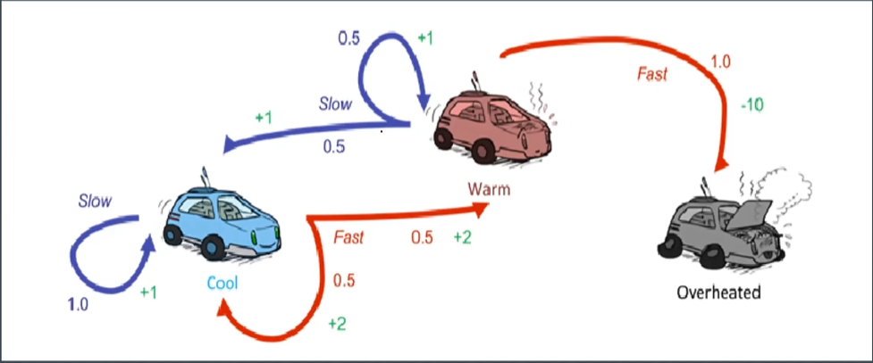

# Policy Iteration Assigment

## Description:


The task is according to the following states, transitions and rewards, determine what should be the best policy to follow using Policy Iteration Method.

## How to Run:

- For Help, run

```
python L3_PolicyIteration.py -h
```

- For running the script, where policies can be:
  1. Random Initial Policy
  2. Always Slow Policy
  3. Always Fast Policy

```
python L3_PolicyIteration.py -p [policy]
```

### Feel to reach me out if you have any doubts.
